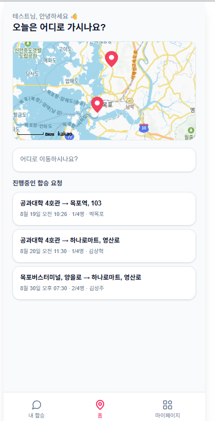
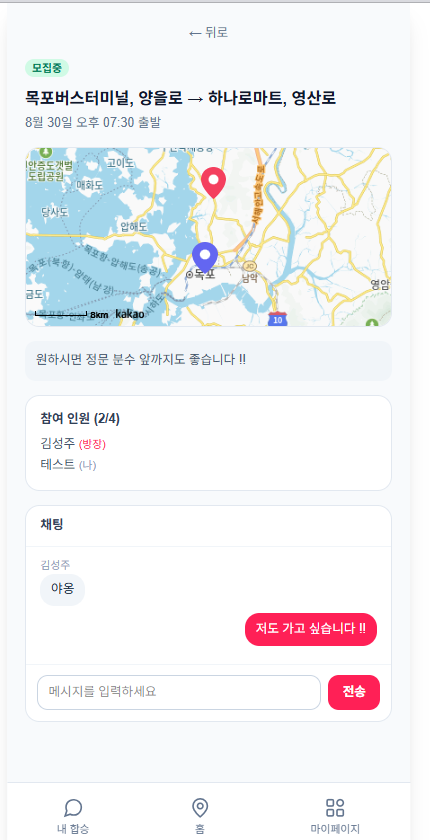

# 타요 (Tayo)

캠퍼스 택시 합승 매칭 서비스 — 목포대학교 창업동아리 프로젝트의 웹 프로토타입.

기획(UI/UX, Figma)에 머물러 있던 아이디어를 실제로 동작하는 풀스택 웹 애플리케이션으로 구현했습니다. 회원가입부터 합승 매칭, 실시간 채팅까지 전체 사용자 플로우가 실제로 동작하며, 보안 요소는 적용에 그치지 않고 실제 공격 페이로드(SQLi, XSS, CSRF)로 직접 검증했습니다.

> 학습·포트폴리오 목적의 프로토타입입니다. 프로덕션 배포를 전제로 하지 않았습니다 (자세한 내용은 [알려진 한계](#알려진-한계) 참고).

## 스크린샷

| 홈 | 합승 상세 (지도 + 채팅) |
|---|---|
|  |  |

| 이메일 인증 | 마이페이지 |
|---|---|
|  |  |

## 핵심 기능

- 학번 기반 회원가입/로그인
- 이메일 인증코드 기반 2단계 회원가입 (Gmail SMTP 실발송)
- 카카오맵 기반 실제 지도 위 출발지/도착지 검색 (캠퍼스 건물 + OpenStreetMap Nominatim 지오코딩으로 목포 시내 전역)
- 합승 요청 등록 → 목록/상세 조회 → 합류 → 정원 도달 시 자동 매칭 전환
- 매칭된 참여자만 접근 가능한 실시간 채팅 (폴링 방식)

## 기술 스택

| 영역 | 기술 |
|---|---|
| 프레임워크 | Next.js 16 (App Router, TypeScript) |
| 데이터베이스 | SQLite + Prisma ORM |
| 인증 | bcrypt + JWT 세션 (httpOnly 쿠키) |
| 지도 | 카카오맵 JavaScript SDK |
| 지오코딩 | OpenStreetMap Nominatim (서버 프록시 + 요청 제한) |
| 이메일 | Nodemailer + Gmail SMTP |
| 검증 | ESLint, TypeScript strict, 프로덕션 빌드 |

## 보안 코딩

각 항목은 적용뿐 아니라 실제 공격 페이로드로 방어 동작까지 직접 확인했습니다.

| 위협 | 대응 |
|---|---|
| SQL 인젝션 | Prisma ORM 파라미터화 쿼리 |
| XSS | React 자동 이스케이프, `dangerouslySetInnerHTML` 미사용 |
| CSRF | 더블 서브밋 쿠키 패턴 (비-httpOnly 토큰 + 커스텀 헤더 대조) |
| 무차별 대입 | 로그인/회원가입/메시지 전송 요청 속도 제한 |
| 권한 우회 | 모든 API에서 세션 기반 인가 체크 (작성자/참여자만 접근) |
| 동시성 오류 | 정원 초과 합류 방지를 위한 DB 트랜잭션 원자적 처리 |
| 인증코드 노출 | SHA-256 해시 저장, 10분 만료, 5회 오답 시 재요청 강제 |

## 시작하기

```bash
npm install
```

`.env` 파일을 만들고 아래 값을 채웁니다 (`.env.example` 참고):

```bash
DATABASE_URL="file:./dev.db"
SESSION_SECRET="<32자 이상의 무작위 문자열>"

# 이메일 인증코드 실발송 (미설정 시 화면에 코드가 표시되는 데모 모드로 동작)
GMAIL_USER="you@gmail.com"
GMAIL_APP_PASSWORD="<Google 앱 비밀번호>"

# 카카오맵 (developers.kakao.com에서 발급, 플랫폼 > Web에 도메인 등록 필요)
NEXT_PUBLIC_KAKAO_MAP_KEY="<카카오 JavaScript 키>"
```

```bash
npx prisma migrate dev
npm run dev
```

`http://localhost:3000`에서 확인할 수 있습니다.

## 프로젝트 구조

```
src/
  app/                 페이지 및 API 라우트 (App Router)
    api/auth/          회원가입(2단계)/로그인/로그아웃/세션 확인
    api/rides/         합승 요청 생성/조회/합류/채팅
    api/geocode/       Nominatim 지오코딩 프록시
  components/          CampusMap, ChatPanel, PoiAutocomplete 등
  lib/                 인증, CSRF, rate limit, 검증, OTP, 카카오맵 로더
prisma/
  schema.prisma        User, RideRequest, RideParticipant, Message, PendingSignup
```

## 알려진 한계

- rate limiting이 인메모리 방식이라 서버 재시작 시 초기화됩니다 (다중 인스턴스 환경에는 Redis 등 공유 저장소 필요)
- 캠퍼스 건물 좌표는 목업 지도 화면에서 추정한 값으로, 실측 GPS 데이터가 아닙니다
- SQLite를 사용해 단일 인스턴스 로컬 환경을 전제로 합니다

## 배경

교내 LINC사업단 및 지역정보문화산업진흥원장상 장려상을 수상한 창업동아리 기획안을, AI 페어 프로그래밍으로 실제 동작하는 프로토타입으로 구현한 프로젝트입니다.
